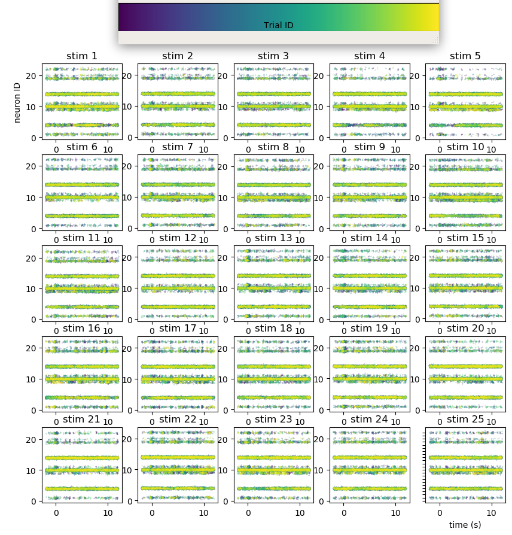

# extraAnalysis
extracellular physiological signal analysis

## A quick estimate of inter-trial response reliability to stimulus presentation

We analyze the trial-to-trial correlation for the same stimulus of different electrophysiological signals.

We first pre-processed the extracellular signals. We run (assuming we have want to analyze an Elphy datafile `4319_CXRIGHT_NBR2.DAT`):

```
python lfp_preprocessing.py 4319_CXRIGHT_NBR2/ 
```

This computes the `lfp`, `MUA` and `gamma_power` quantities (described below).

### Local Field Potential

Obtained by:
1. Subsampling all extracellular signals at 1khz
2. Averaging over all electrodes


Above figure obtained by running:
```
python trial_view_raw.py 4319_CXRIGHT_NBR2/ lfp
```
### Multi-Unit Activity

Obtained by:
1. Subsampling all extracellular signals at 10khz
2. Computing the envelope of the (max. power) of the frequency band: [300, 3000]Hz (discretized in 10 wavelets equally spaced)
3. Subsampling all resulting envelope signals at 1khz
4. Averaging over all electrodes


Above figure obtained by running:
```
python trial_view_raw.py 4319_CXRIGHT_NBR2/ MUA
```

### Gamma-band activity

Obtained by:
1. Subsampling all extracellular signals at 10khz
2. Computing the envelope of the (max. power) of the frequency band: [30, 80]Hz (discretized in 10 wavelets equally spaced)
3. Subsampling all resulting envelope signals at 1khz
4. Averaging over all electrodes


Above figure obtained by running:
```
python trial_view_raw.py 4319_CXRIGHT_NBR2/ gamma_power
```

### Spikes

Obtained by spike-sorting (/!\ seemingly broken /!\)



Above figure obtained by running:
```
python trial_view_spikes.py 4319_CXRIGHT_NBR2
```
